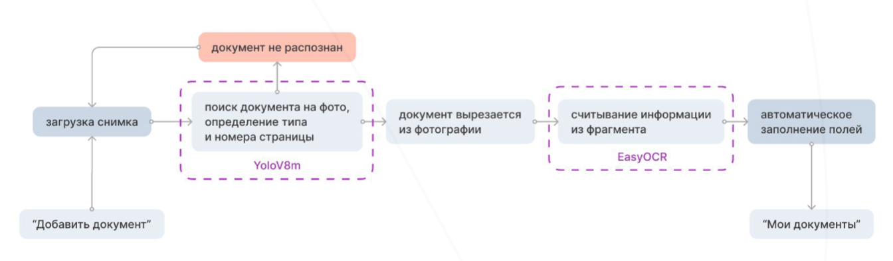

# Gagarin_Hack 

*Misis status.md team*

Team Members:
1) Анна Гулякина - Design
2) Кирилл Рыжичкин - ML Engineer
3) Дмитрий Коноплянников - Frontend
4) Егор Чистов - Backend
5) Груздев Александр - ML Engineer

Презентация: [link](https://drive.google.com/file/d/1fZIjuwKuIodLqORF8AYsbfmmWOpGgiwP/view?usp=sharing)

## Задача трека "Меркурий"

> Разработать сервис, позволяющий в режиме работы по api с определенной вероятностью классифицировать фото-сканы автомобильных документов по их типам - определить вероятности соответствия конкретному типу (водительское удостоверение, свидетельство о регистрации транспортного средства, птс, паспорт РФ), а также номер листа/стороны документа, и получить основную информацию/атрибутику из каждого документа.

## Предложенное решение

В результате работы над поставленной задачей были обучены модели YoloV8m, YoloV8s для распознавания типа документа и его границ. Наша модель способна работать с фотографиями, на которых расположено несколько документов (определяет их все), на которых документ искажен, плохо виден текст. Дополнительно была обучена YoloV8s для определения местоположения серии и номера на документе, которая поможет в дальнейшем ускорить и упростить процесс распознавания текста. Также изначальна была обучена ResNet15 для классификации документов (более лёгкая модель для детекции типа документа и его стороны, не использовалась в итоговом решении). 

Протестировать сервис можно по ссылке: [statusmd.itatmisis.ru](http://statusmd.itatmisis.ru/)

Принцип работы системы изображен на блок-схеме:




**Компьютерное зрение:** 
1) Для определения границ документа и классификации его типа и страницы используется модель YoloV8m. При необходимости можно использовать более легковесные модели данной архитектуры. Экспериментально было обнаружено, что это не критически сказывается на качестве работы модели. Пайплайн обучения можно найти в [YOLO_training_pipeline.ipynb](https://github.com/l1ghtsource/gagarin-hack-document-reader/blob/main/ml/Yolo_training_pipeline.ipynb)
2) Для оптического распознавания символов применяется EasyOCR. По результатам тестов и изучения статей данное решение показало наилучшее соотношение качества распознавания и времени работы. Подробнее о работе алгоритма оптического распознавания в [gagarin-final.ipynb](https://github.com/l1ghtsource/gagarin-hack-document-reader/blob/main/ml/gagarin-final.ipynb)

Почему именно EasyOCR: [blog.roboflow.com/best-ocr-models-text-recognition](https://blog.roboflow.com/best-ocr-models-text-recognition/)


**Серверная часть:**
1) API реализовано с помощью Docker compose из двух контенеров на FastAPI, в котором один сервис отвечает за обработку запросов извне, а в другом непосредственно происходят распознавание и классификация.
2) FRONTEND React Реализована автоматическая сборка и загрузка на сервер статической части сайта. https://github.com/l1ghtsource/gagarin-hack-document-reader/blob/main/.github/workflows/front_build_deplloy.yaml
3) На сервере работает traefik в режиме reverse-proxy. Он разделяет запросы к API и запросы к сайту между докер-контейнерами API и frontend

Может сюда пример работы программы в гифке запиздячить, я хз 


## Запуск решения для теста
исходный код фронтенда лежит в gagarin-hack-frontend
исходный код бэкенда лежит в backend/api
### Запуск backend:
настроить .env файл.
Разместить файлы моделей из models в удобном месте и указать путь на директорию их расположения в EASYOCR_PATH и YOLO_PATH

 - чтобы протестировать API достаточно запустить ```docker compose up -f docker-compose-no-traefik.yaml``` тогда по порту, указанному в .env будет доступно API
 - если надо запустить через traefik, нужно использовать ```docker compose up -f docker-compose-traefik.yaml```


### Запуск frontend:

- статические файлы сайта должны лежать в директории build, которая в одной директории с файлом compose
- frontend часть сайта отдается apache сервером через traefik. для этого надо запустить ```docker compose up```

 Можно настроить CI/CD, для этого в репозитории нужно создать secret keys
 1. SSH_HOST с IP адресом сервера
 2. SSH_KEY с приватным ключом, по которому можно залогиниться на сервер
 3. STATIC_FOLDER с путем к папке frontenda. Например ```~/gagarin-hack-document-reader/backend/static_front```
 тогда сборка будет происходить при запуске workflow

## Перспективы развития, возможные "узкие места" и методы их решения 

В репозитории проекта представлены следующие невошедшие в финальный продукт наработки, которые, потенциально, могут быть использованы в случае необходимости: 

1) Multilabel_Classification.ipynb - Легковесная модель, не использующая архитектуру YOLO и, потенциально, требующая меньше времени и вычислительных ресурсов. Может быть использована если необходимо получить решение, работающее на телефоне
2) Yolo_Serial_Number_Detector.pt - Модель YoloV8s обученная находить в документе расположение серийного номера и серии. Может быть использована при увеличении размеров датасета для ускорения работы алгоритма оптического распознования
